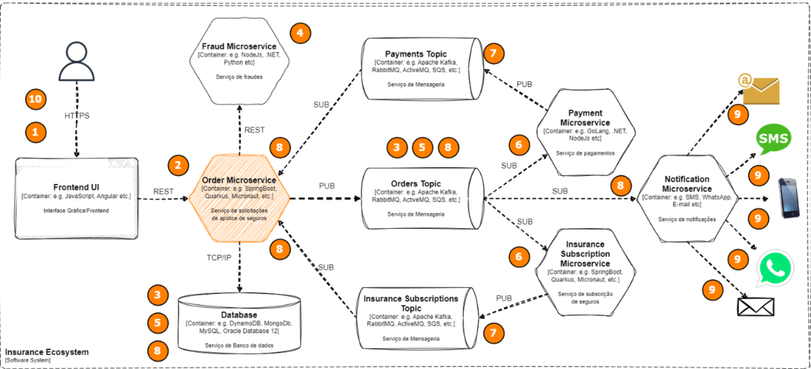
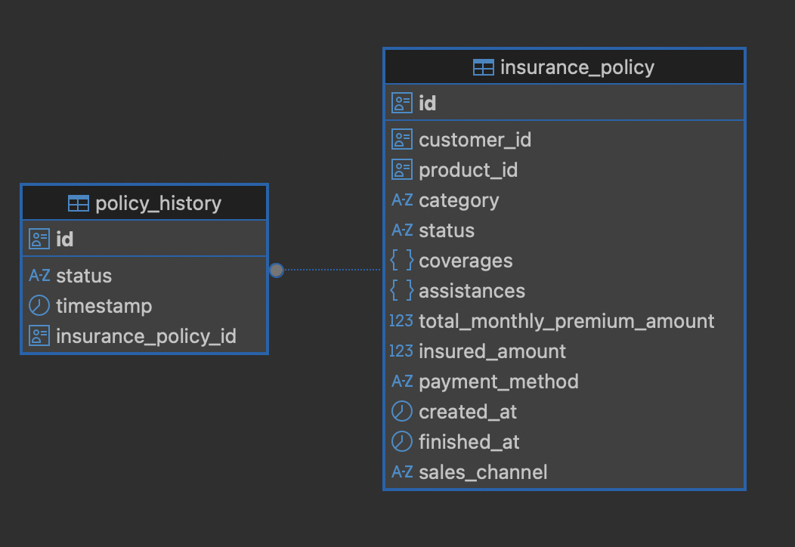

# Desafio Software Engineer Itaú - Microsserviço de Apólices de Seguro

> Este projeto é um microsserviço desenvolvido como parte de um desafio técnico para uma posição de **Software Engineer** no Itaú.  O objetivo é gerenciar o ciclo de vida de solicitações de apólices de seguro, implementando uma arquitetura orientada a eventos (EDA).

[](https://www.oracle.com/java/technologies/javase/jdk17-archive-downloads.html)
[](https://maven.apache.org/download.cgi)
[](https://docs.docker.com/desktop/setup/install/windows-install)

## 📜 Tabela de Conteúdos

* [Funcionalidades Principais](#funcionalidades-principais)
* [Tecnologias Utilizadas](#tecnologias-utilizadas)
* [Como Executar a Solução](#como-executar-a-solucao)
* [Testando a Aplicação](#testando-a-aplicacao)
* [Decisões e Arquitetura da Solução](#decisoes-e-arquitetura-da-solucao)
* [Endpoints da API](#endpoints-da-api)
* [Premissas e Decisões de Design](#premissas-e-decisoes-de-design)
* [Estratégia de Testes](#estrategia-de-testes)
* [Melhorias Futuras](#melhorias-futuras)
* [Autor](#autor)

<h2 id="funcionalidades-principais">✨ Funcionalidades Principais </h2>

* **Recepção de Solicitações:** API REST para receber e persistir novas solicitações de apólice.
* **Gerenciamento do Ciclo de Vida:** Controle de estados da solicitação (`Recebido`, `Validado`, `Pendente`, `Aprovado`, `Rejeitado`, `Cancelado`).
* **Integração com API de Fraudes:** Consumo de uma API (mockada) para análise e classificação de risco do cliente.
* **Aplicação de Regras de Negócio:** Validações baseadas no tipo de cliente (`Regular`, `Alto Risco`, `Preferencial`, `Sem Informação`) e no capital segurado.
* **Publicação de Eventos:** Publicação dos resultados de cada alteração de estado para notificar outros sistemas.
* **Consulta de Solicitações:** API REST para consultar solicitações por ID da solicitação ou ID do cliente.
* **Cancelamento de Solicitação:** API REST para cancelar uma apólice, exceto quando já aprovada.

<h2 id="tecnologias-utilizadas">💻 Tecnologias Utilizadas</h2>

| Tecnologia | Finalidade |
| :--- | :--- |
| **Java 17** | Linguagem de programação principal |
| **Spring Boot** | Framework para construção da aplicação e da API REST |
| **Maven** | Gerenciador de dependências e build do projeto |
| **Docker & Docker Compose**| Orquestração da infraestrutura e execução da aplicação |
| **Kafka** | Broker de Mensageria |
| **PostgreSQL** | Banco de Dados |
| **Mockserver** | Servidor de Mock  |
| **JUnit 5 & Mockito** | Testes de unidade e integração |

<h2 id="como-executar-a-solucao">▶️ Como Executar a Solução </h2>

### Pré-requisitos
- Docker e Docker Compose instalados
- Portas 8080, 8082, 1080 e 5432 livres na máquina

### Rodando o projeto

1.  **Clone o repositório:**
    ```bash
    git clone https://github.com/jPedroSoares/teste-tecnico-itau.git
    cd teste-tecnico-itau
    ```

2.  **Suba os contêineres:**
    ```bash
    docker-compose up -d --build
    ```

3.  **Aguarde uns 30-60 segundos** para tudo subir corretamente.

4.  **Teste se funcionou:**
    ```bash
    curl http://localhost:8080/health
    ```
    Se retornar `{"status":"UP"}`, está tudo certo!

### Se algo der errado:
- **Porta ocupada?** Mate o processo com `lsof -ti:8080 | xargs kill -9`
- **Containers não sobem?** Rode `docker-compose down -v` e tente novamente
- **Banco não conecta?** Aguarde mais um pouco, o PostgreSQL demora para inicializar

Após tudo funcionar, o ambiente estará disponível:

* **API do Microsserviço:** `http://localhost:8080`
* **Servidor de Mocks:** - `http://localhost:1080`
* **UI do Servidor de Mocks:** - `http://localhost:1080/mockserver/dashboard`
* **UI do Broker:** - `http://localhost:8082`

<h2 id="testando-a-aplicacao"> Testando a Aplicação </h2>


### 1. Criar uma nova apólice

```bash
curl -X POST http://localhost:8080/api/insurance-policies \
  -H "Content-Type: application/json" \
  -d '{
    "customerId": "66041e44-1795-46c0-9c97-eb61af711023",
    "productId": "0407c0fd-2c56-4042-87d3-b5d8245eda3c",
    "category": "AUTO",
    "salesChannel": "MOBILE",
    "paymentMethod": "CREDIT_CARD",
    "totalMonthlyPremiumAmount": 75.25,
    "insuredAmount": 12000.00,
    "coverages": {
        "Roubo": 30000.25,
        "Perda Total": 60000.25,
        "Colisão com Terceiros": 5000.00
    },
    "assistances": [
        "Guincho até 250km",
        "Troca de Óleo",
        "Chaveiro 24h"
    ]
}'
```

**Resposta esperada:** A apólice será criada com status `RECEIVED`, mudará para `VALIDATED` após a consulta à API de fraudes e depois para `PENDING` até ser aprovada ou rejeitada.

### 2. Para aprovar ou rejeitar a apólice

O sistema aguarda um evento nos tópicos `payment-topic` e `insurance-subscriptions-topic` do Kafka. Você pode simular isso usando UI do Kafka:

1. Acesse `http://localhost:8082`
2. Vá em "Topics" → "payment-topic" | "insurance-subscriptions-topic"
3. Clique em "Produce Message"
4. Cole um dos JSONs abaixo e clique em "Produce Message"

```bash
# Aprovar a apólice
# Cole este JSON (substitua os IDs pelos reais):
{
  "eventId": "293e805b-1a96-4170-95ae-94b6e1161346",
  "eventType": "ORDER_APPROVED",
  "policyId": "SEU_POLICY_ID_AQUI",
  "customerId": "123e4567-e89b-12d3-a456-426614174000",
  "status": "APPROVED",
  "timestamp": "2025-10-14T15:28:57.307129"
}

# Ou rejeitar a apólice
{
  "eventId": "293e805b-1a96-4170-95ae-94b6e1161346",
  "eventType": "ORDER_REJECTED",
  "policyId": "SEU_POLICY_ID_AQUI",
  "customerId": "123e4567-e89b-12d3-a456-426614174000",
  "status": "REJECTED",
  "timestamp": "2025-10-14T15:28:57.307129"
}
```

### 3. Verificar o resultado

```bash
curl http://localhost:8080/api/insurance-policies/policy/{id}
```

O status deve estar `APPROVED` ou `REJECTED` conforme o evento enviado.

### 4. Listar apólices por cliente

```bash
curl http://localhost:8080/api/insurance-policies/customer/{customerId}
```

### 5. Cancelar uma apólice

```bash
curl -X PATCH http://localhost:8080/api/insurance-policies/{id}/cancel
```

### Usando Postman

* **Collection do Postman:** Importe o arquivo `docs/insurance_policy_management_api_postman_collection.json` no seu Postman

### Documentação Adicional

Para exemplos mais detalhados e cenários específicos:

* **[Exemplos de Payloads](docs/api-examples.md)** - Payloads prontos para diferentes tipos de seguro
* **[Exemplos Anti-Fraud](docs/anti-fraud-examples.md)** - Regras de validação e cenários de teste baseados na classificação de risco

<h2 id="decisoes-e-arquitetura-da-solucao">🤔 Decisões e Arquitetura da Solução</h2>

### Por que Kafka ao invés de RabbitMQ?

Escolhi Kafka principalmente por experiência prévia, facilidade de uso com Spring Boot e configuração simples via Docker Compose. Além disso acredito que Kafka é mais adequado para cenários de alta escala e necessidade de armazenamento dos eventos, para retentativas em caso de falhas, o que se alinha bem com o desafio.

### Clean Architecture

Era um dos pré-requisitos do desafio e eu já tinha experiência com ela, então foi natural usar. Os principais benefícios que obtive:

* **Testabilidade:** Consegui escrever testes unitários isolados
* **Flexibilidade:** Posso trocar banco ou broker sem afetar as regras de negócio  
* **Organização:** Separação clara entre Domain, Application e Infrastructure

### State Pattern para o ciclo de vida

Optei pelo State Pattern porque:

* Cada estado tem suas próprias regras de transição
* É mais fácil adicionar novos estados no futuro
* Evita switches complexos e melhora a legibilidade

### Strategy Pattern para tipos de cliente

Cada tipo de cliente (Regular, Alto Risco, etc.) tem regras diferentes de validação. O Strategy permite adicionar novos tipos sem mexer no código existente - aplicando o princípio Open/Closed.

### Remoção do Swagger

Implementei o Swagger inicialmente, mas removi depois porque o tratamento de erros customizado acabou conflitando com ele. Por considerar o tratamento robusto de erros mais importante, optei por removê-lo, priorizando qualidade ao invés de conveniências. Como alternativa mantive exemplos práticos neste README e documentação detalhada nos arquivos `docs/api-examples.md` e `docs/anti-fraud-examples.md`. Além da collection do Postman já citada anteriormentet.

<h2 id="diagramas-e-arquitetura-visual">🎨 Diagramas e Arquitetura Visual</h2>

Diagrama da Arquitetura do Microsserviço



Diagrama de Entidade-Relacionamento (ER)



<h2 id="endpoints-da-api">📡 Endpoints da API</h2>
Abaixo estão os principais endpoints expostos pela API REST:

| Verbo | Rota | Descrição |
| :--- | :--- | :--- |
| **POST** | /api/insurance-policies | Cria uma nova solicitação de apólice. |
| **GET** | /api/insurance-policies/policy/{id} | Consulta uma solicitação por ID da apólice. |
| **GET** | /api/insurance-policies/customer/{customerId} | Consulta solicitações por ID do cliente. |
| **PATCH** | /api/insurance-policies/{id}/cancel | Cancela uma solicitação de apólice, se aplicável. |
| **GET** | /health | Verifica o status de saúde da aplicação. |

## 💭 Premissas

### Estados da apólice

Segundo a descrição do desafio, o status "Received" (Recebido) só pode transitar para "Validated" (Validado) ou "Cancelled" (Cancelado). Porém, tomei a liberdade de permitir transição direta de "Recebido" para "Rejeitado" também se a validação inicial falhar.

Também assumi que alguns valores que estavam como `R$ 150.00,00` eram erros de digitação e deveriam ser `R$ 150.000,00`.

<h2 id="estrategia-de-testes"> 🧪 Estratégia de Testes </h2>

### Comandos para Executar Testes

```bash
# Todos os testes
./mvnw test
```

### Decisões sobre Testes

#### Testes Unitários - Prioridade Alta
Cobri todas as regras de negócio principais porque são o coração do sistema:

* **Estados da apólice:** Cada transição testada isoladamente
* **Strategies de validação:** Todos os tipos de cliente e limites
* **Interactors:** Orquestração dos casos de uso
* **Processamento de eventos:** Kafka consumer logic

Foquei nesses testes por considerar as regras de negócio o ponto mais crítico - um bug na validação pode aprovar/rejeitar incorretamente uma apólice.

#### Testes de Integração - Implementação Parcial
Implementei alguns testes de integração, mas focaria mais em:

* **Testes end-to-end:** Da API até o banco e Kafka
* **Contract testing:** Garantir compatibilidade com API de fraude
* **Performance:** Validar tempo de resposta sob carga

**Trade-off consciente:** Priorizei qualidade dos unitários vs quantidade de integração, considerando tempo do desafio.

# 🚀 Melhorias Futuras

Algumas funcionalidades que implementaria nas próximas iterações:

* **Health checks** mais robustos (verificar conectividade com Kafka, banco, API externa)
* **Rate limiting** para evitar spam de requests
* **Cache Redis** para consultas frequentes
* **Paginação** nas APIs de listagem


<h2 id="autor">👨‍💻 Autor </h2>

<a href="https://github.com/jPedroSoares">
 
 <br />
 <sub><b>João Soares</b></sub></a>

👋🏽 Entre em contato!

[](https://www.linkedin.com/in/jpedrosoares1/)
[](mailto:joao.soares204@hotmail.com)
